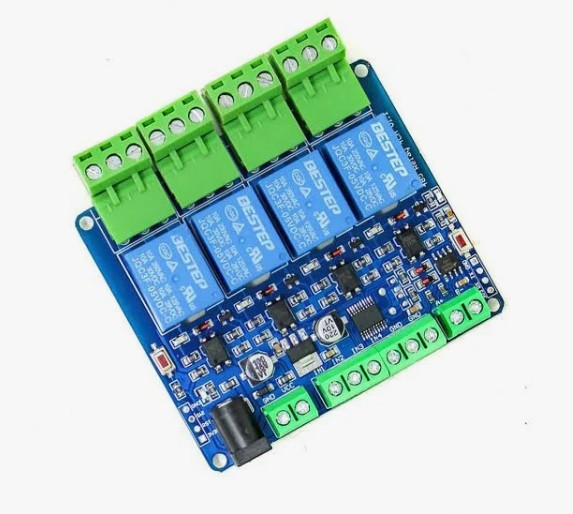

# 485 Relay 4CH v1.1 - Modbus RTU Control

> **Finally!** Documentation for the mysterious "485 Relay 4CH v1.1" Modbus RTU relay board that has virtually no documentation online.



## The Problem

If you bought this board, you probably noticed:
- No English documentation
- No datasheet
- Relays work with trial and error, but **inputs don't seem to respond**
- Generic listings with no register maps

**This repository solves that.** We reverse-engineered the Modbus registers and discovered the quirks that make the inputs work.

## Board Specifications

| Specification | Value |
|--------------|-------|
| **Model** | 485 Relay 4CH v1.1 |
| **Voltage** | 5V DC |
| **Relays** | 4x 10A 250VAC / 10A 30VDC |
| **Inputs** | 4x Opto-isolated (active LOW) |
| **Communication** | Modbus RTU (RS485 or TTL) |
| **Default Baud Rate** | 9600 |
| **Default Device ID** | 1 |

## Quick Start

### Requirements

```bash
pip install pymodbus pyserial
```

### Basic Usage

```python
from relay_monitor import RelayBoard

board = RelayBoard('/dev/ttyUSB0')

# Control relays
board.relay_on(1)   # Turn on relay 1
board.relay_off(1)  # Turn off relay 1

# Read inputs (returns True when triggered)
inputs = board.get_inputs()
print(inputs)  # {'IN1': True, 'IN2': False, 'IN3': False, 'IN4': False}

# Read relay states
relays = board.get_relays()
print(relays)  # {'R1': True, 'R2': False, 'R3': False, 'R4': False}

board.close()
```

## Wiring

### TTL Connection (USB-TTL Adapter)

```
USB-TTL Adapter    →    Relay Board
─────────────────────────────────────
TX                 →    RX
RX                 →    TX
GND                →    GND
(Don't connect VCC - board has its own 5V power)
```

### RS485 Connection

```
RS485 Adapter      →    Relay Board
─────────────────────────────────────
A+                 →    A+
B-                 →    B-
GND                →    GND (optional but recommended)
```

### Input Wiring (Active LOW)

The opto-isolated inputs are **active LOW** - connecting to GND triggers them:

```
To trigger an input:
─────────────────────────────────────
Input Terminal (IN1-IN4)  →  GND

For switch/button:
─────────────────────────────────────
Switch one side     →    INx terminal
Switch other side   →    GND terminal
```

## Modbus Register Map

This is the **critical information** that's missing from all documentation:

### Communication Settings

| Setting | Value |
|---------|-------|
| Baud Rate | 9600 (default) |
| Data Bits | 8 |
| Parity | None |
| Stop Bits | 1 |
| Device ID | 1 (default) |

### Register Map

| Function Code | Address | Count | Description |
|--------------|---------|-------|-------------|
| **01** (Read Coils) | 0x0000 | **8** | Read relay states (bits 0-3) |
| **02** (Read Discrete Inputs) | 0x0000 | **8** | Read input states (bits 0-3) |
| **05** (Write Single Coil) | 0x0000-0x0003 | - | Control relays 1-4 |

### Important Quirks

> **The board only responds to read requests for 8 bits, not 4!**

This is why many people can't read the inputs - they request 4 bits and get no response.

```python
# WRONG - No response!
request = build_request(1, 0x02, 0x0000, 0x0004)

# CORRECT - Works!
request = build_request(1, 0x02, 0x0000, 0x0008)
```

### Raw Modbus Frames

**Read Relays (Function 01):**
```
TX: 01 01 00 00 00 08 3D CC
RX: 01 01 01 XX 51 88
    └─ XX = relay status byte (bits 0-3 = R1-R4)
```

**Read Inputs (Function 02):**
```
TX: 01 02 00 00 00 08 79 CC
RX: 01 02 01 XX 20 4C
    └─ XX = input status byte (bits 0-3 = IN1-IN4, active LOW)
```

**Turn Relay 1 ON (Function 05):**
```
TX: 01 05 00 00 FF 00 8C 3A
RX: 01 05 00 00 FF 00 8C 3A  (echo)
```

**Turn Relay 1 OFF (Function 05):**
```
TX: 01 05 00 00 00 00 CD CA
RX: 01 05 00 00 00 00 CD CA  (echo)
```

### Input Status Decoding

The input byte uses **active LOW** logic:
- `0` = Input triggered (connected to GND)
- `1` = Input not triggered (floating/open)

Example: `0x0E` = `00001110` binary
- Bit 0 (IN1) = 0 → **TRIGGERED**
- Bit 1 (IN2) = 1 → not triggered
- Bit 2 (IN3) = 1 → not triggered
- Bit 3 (IN4) = 1 → not triggered

## Included Scripts

### relay_monitor.py

Full-featured control and monitoring script:

```bash
# Interactive mode (default)
python relay_monitor.py

# Real-time monitoring
python relay_monitor.py monitor

# Test all relays
python relay_monitor.py test
```

**Interactive commands:**
- `1-4` - Toggle relay 1-4
- `on N` - Turn relay N on
- `off N` - Turn relay N off
- `all on` - All relays on
- `all off` - All relays off
- `status` - Read current status
- `monitor` - Start continuous monitoring
- `quit` - Exit

### input_to_relay.py

Maps inputs directly to relays (IN1→R1, IN2→R2, etc.):

```bash
python input_to_relay.py
```

Useful for testing inputs or creating simple automation where each input controls its corresponding relay.

## Troubleshooting

### No response from board

1. **Check power** - Board needs 5V DC, LED should be on
2. **Check wiring** - TX/RX must be crossed (TX→RX, RX→TX)
3. **Try swapping TX/RX** - Common mistake
4. **Check baud rate** - Default is 9600
5. **Check device ID** - Default is 1

### Relays work but inputs don't respond

This is the most common issue! The solution:

**Request 8 bits, not 4:**
```python
# Use count=8 in your Modbus request
result = client.read_discrete_inputs(address=0, count=8, device_id=1)
```

### Inputs always show as triggered/not triggered

- Inputs are **active LOW** - connect to GND to trigger
- Floating inputs read as "not triggered"
- If always triggered, check for shorts to GND

## CRC16 Calculation

For those implementing raw Modbus communication:

```python
def calc_crc16(data):
    """Calculate Modbus CRC16"""
    crc = 0xFFFF
    for byte in data:
        crc ^= byte
        for _ in range(8):
            if crc & 0x0001:
                crc = (crc >> 1) ^ 0xA001
            else:
                crc >>= 1
    return crc.to_bytes(2, 'little')
```

## Hardware Photos

The board has these main components:
- 4x BESTEP relays (10A 250VAC)
- RS485 transceiver chip
- Opto-isolators for inputs
- DIP switch for address setting (if present)
- TTL header (4-pin: GND, TX, RX, VCC)
- RS485 terminals (A+, B-)
- Input terminals (IN1-IN4 + COM/GND)
- Relay output terminals (NO, COM, NC for each relay)

## Contributing

Found more register addresses? Different board version? Please open an issue or PR!

## License

MIT License - Use freely, attribution appreciated.

## Acknowledgments

Reverse-engineered with patience and a logic analyzer. If this saved you hours of frustration, consider starring the repo!

---

**Keywords for search:** 485 relay 4ch, modbus relay board, modbus rtu relay, 4 channel relay modbus, relay board inputs not working, modbus discrete inputs
